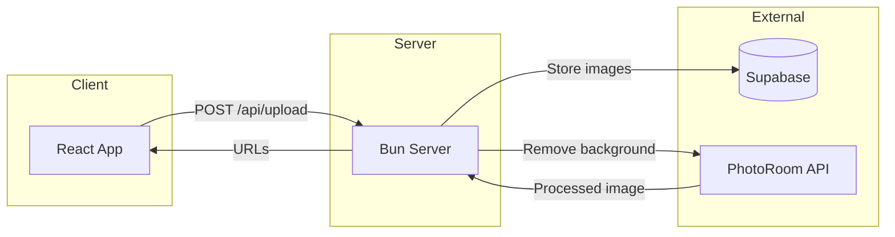
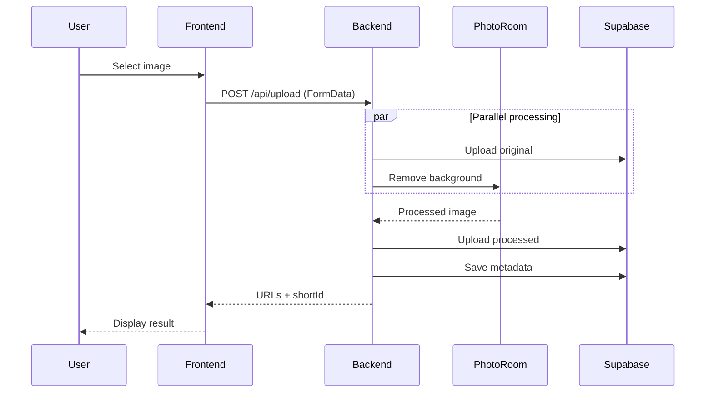
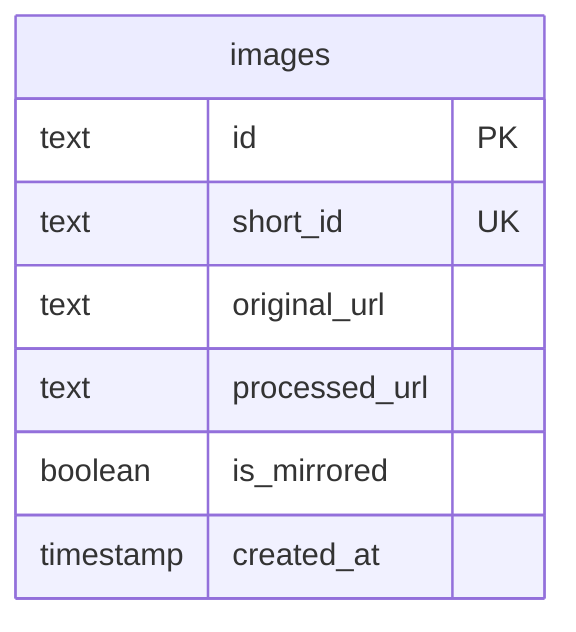

# Architecture

UnBg is a full-stack image background removal service. Users upload images, backgrounds are removed via AI, and results are stored for sharing.

## System Overview



## Request Flow



## Project Structure

```
UnBg/
├── src/                    # React frontend
│   ├── App.tsx             # Main component, state management
│   └── components/
│       ├── DropZone.tsx    # File upload (drag/drop/paste)
│       ├── ImagePreview.tsx
│       └── ResultDisplay.tsx
│
├── server/src/             # Bun backend
│   ├── index.ts            # HTTP server, routing
│   ├── lib/
│   │   ├── config.ts       # Environment config
│   │   ├── photoroom.ts    # PhotoRoom API client
│   │   ├── supabase.ts     # Supabase client
│   │   ├── security.ts     # Rate limiting, validation
│   │   └── imageUtils.ts   # Image manipulation (sharp)
│   └── routes/
│       ├── upload.ts       # POST /api/upload
│       ├── images.ts       # GET/DELETE /api/images/:id
│       └── redirect.ts     # GET /i/:shortId
```

## API Endpoints

| Method | Path              | Description                          |
| ------ | ----------------- | ------------------------------------ |
| POST   | `/api/upload`     | Upload image, returns processed URLs |
| GET    | `/api/images/:id` | Get image metadata                   |
| DELETE | `/api/images/:id` | Delete image and files               |
| GET    | `/i/:shortId`     | Redirect to processed image          |
| GET    | `/health`         | Health check                         |

## Data Model



**Storage paths:**

- `originals/{id}.png` - uploaded image
- `processed/{id}.png` - background removed

## Security

- **Rate limiting**: 30 requests/minute per IP
- **File validation**: Magic number checks (not just MIME type)
- **Filename sanitization**: Strips unsafe characters
- **CORS**: Configurable allowed origins
- **Headers**: X-Frame-Options, X-Content-Type-Options, etc.

## Tech Stack

| Layer    | Technology                                  |
| -------- | ------------------------------------------- |
| Frontend | React 19, Vite, Tailwind CSS, Framer Motion |
| Backend  | Bun, TypeScript                             |
| Database | Supabase (PostgreSQL)                       |
| Storage  | Supabase Storage                            |
| AI       | PhotoRoom API                               |
